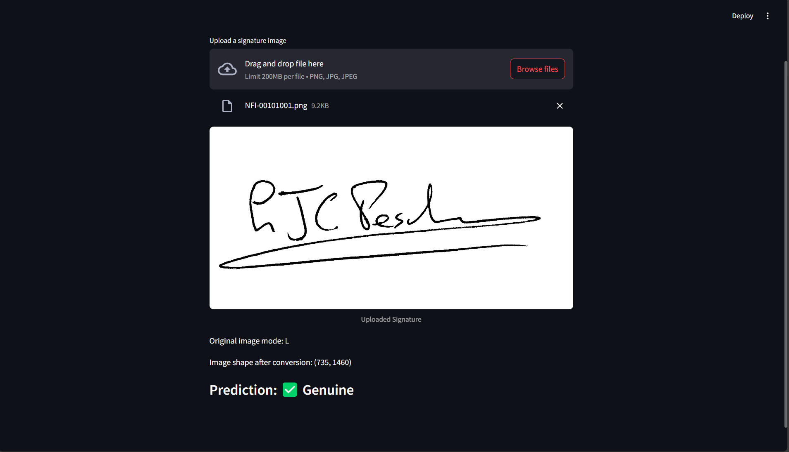
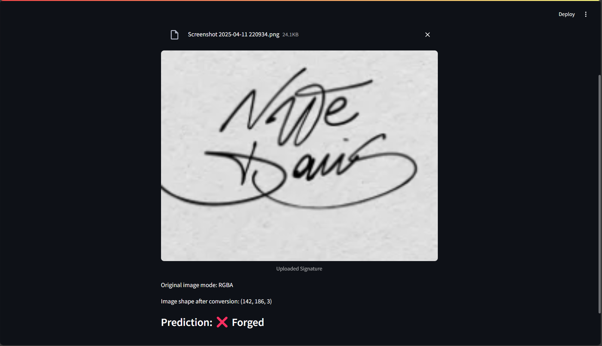

# ✍️ Signature Verification System using HOG + SVM

This project is a **Signature Verification System** that uses **Computer Vision** and **Machine Learning** to verify whether a signature is *genuine* or *forged*. It utilizes **Histogram of Oriented Gradients (HOG)** for feature extraction and a **Support Vector Machine (SVM)** classifier for signature classification. A simple **Streamlit** UI allows for real-time signature verification.

## 📌 Features

- Image preprocessing (grayscale, thresholding, resizing)
- HOG feature extraction
- SVM classifier (trained and tested)
- Real-time verification via Streamlit interface
- Displays verification result: ✅ Genuine or ❌ Forged

## 🖼 Sample Output

| Input Signature | Prediction |
|----------------|------------|
|  | ✅ Genuine |
|   | ❌ Forged |

---

## 🧠 Technologies Used

- Python
- OpenCV
- Scikit-learn
- Streamlit
- NumPy
- Matplotlib

---

## 🗂️ Project Structure

signature-verification/
│
├── dataset                             # Folder containing all signature images
│   link to download dataset:             https://www.kaggle.com/datasets/divyanshrai/handwritten-signatures/data
│
├── signature_verification.ipynb        # Jupyter notebook for model building, training, and testing
│
├── app.py                              # Streamlit app for uploading and verifying signatures
│
└── signature_verification.pkl          # Trained SVM model saved using pickle or joblib
